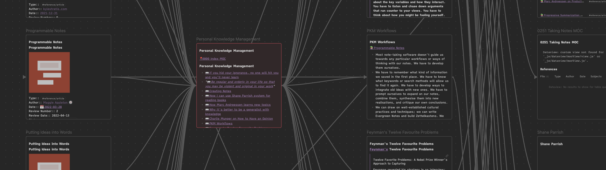
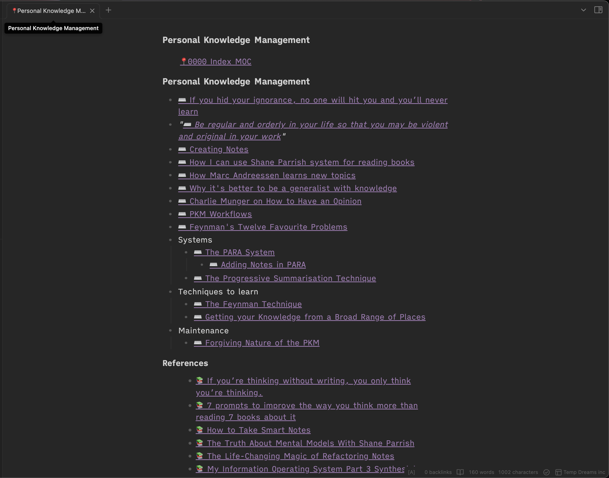
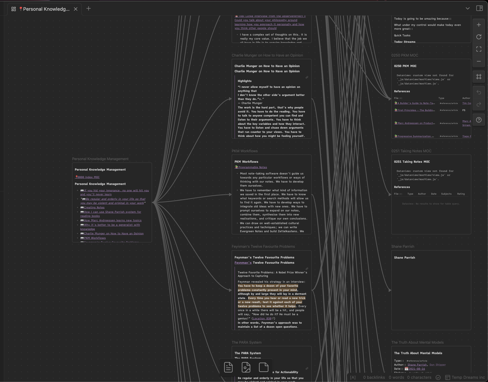

# 🔗💣 Overview

> 🎉 **0.3 Release:** Now with support for setting the destination of the created canvas (thanks @UNEXENU)

Link Exploder is a Obsidian plugin that creates a [canvas](https://obsidian.md/canvas) from a note, embedding it's incoming (i.e. backlinks) and outgoing links onto the canvas (as well as the their linked notes). The new canvas will be added to your root directory using the name of the note it's based off.

## Use Cases

- Useful for converting those MoCs (Map of Contents) into a visual map visually exploring topics and how they interact with each other.
- Starting a canvas using items in your vault. Create a new note with a few links to topics you want to explore then call the "Create Canvas From File Links" action and you'll have a new canvas which pulls in the notes you linked as well as their linked notes too.
- An interactive version of your local graph.

## Examples

## Install

Now available on the plugin marketplace! Get it [here](https://obsidian.md/plugins?id=link-exploder)

## Usage

After installation navigate to a page you would like to create a canvas version of and then use the "Create Canvas From File Links" action from the command palette

## Notes

- this is a first release so very basic at the moment
- Love to hear feedback on features to make this better.
